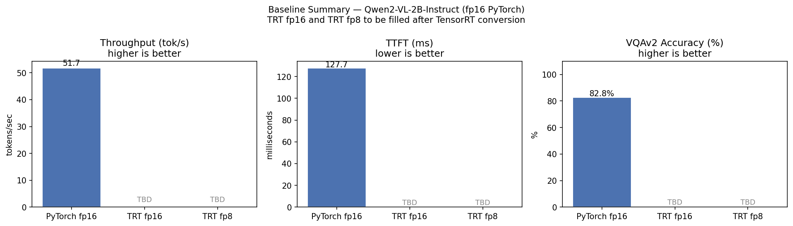

# VLM Baseline Benchmark — Combined Report

**Run ID**: `20260512_173641`
**Generated**: 2026-05-12 10:39:38 PDT
**Type**: Efficiency (run_benchmark.py) + Accuracy (lmms-eval)

---

## 1. Environment

| Item | Value |
|------|-------|
| Model | Qwen2-VL-2B-Instruct |
| Precision | fp16 |
| Backend | pytorch |
| GPU | NVIDIA GeForce RTX 5060 Ti (16 GB) |
| CUDA Toolkit | 12.8 |
| TensorRT-LLM Container | 0.21.0 |
| PyTorch | 2.8.0 |
| Transformers | 4.51.3 |
| lmms-eval | unknown@unknown |

---

## 2. Efficiency Results

*50 VQAv2 samples, 3 warmup runs, seed=42*

| Metric | Mean | Std | Median | p95 |
|--------|------|-----|--------|-----|
| TTFT (ms) | 127.7 | 29.7 | 118.0 | 206.4 |
| Total Latency (ms) | 562.4 | 108.2 | 536.7 | 788.9 |
| Throughput (tok/s) | 51.7 | 7.7 | 51.5 | 64.8 |
| Peak VRAM (GB) | 4.26 | 0.023 | 4.25 | 4.32 |

**Model VRAM (static)**: 4.55 GB
**Prompt**: `<question> Answer in a complete sentence.`
**min_new_tokens**: 20 | **max_new_tokens**: 50

---

## 3. Accuracy Results (lmms-eval)

*Evaluated with [lmms-eval](https://github.com/EvolvingLMMs-Lab/lmms-eval) — the standard VLM evaluation toolkit used in research.*

| Item | Value |
|------|-------|
| Task | `vqav2_val` |
| Metric | exact_match (ignore_case, ignore_punctuation) |
| Num Samples | 500 |
| Max New Tokens | 16 |
| Post Prompt | `Answer the question using a single word or phrase.` |
| Eval Time | 90.8s |

### VQAv2 Exact Match Score

| | Value |
|-|-------|
| **Score** | **82.8%** |
| Stderr | ±1.5% |

> lmms-eval uses `exact_match` with case and punctuation normalization.
> The prompt `Answer the question using a single word or phrase.` is automatically appended to each question,
> instructing the model to answer with a single word or phrase —
> matching the VQAv2 ground truth format.

---

## 4. Summary Chart

*Grey bars (TBD) will be filled after TensorRT engine conversion.*

---

## 5. Baseline Numbers — TRT Comparison Table

*Reference table to be completed after TensorRT fp16 and fp8 engine conversion.*

| Metric | PyTorch fp16 | TRT fp16 | TRT fp8 |
|--------|-------------|----------|---------|
| TTFT (ms) | 127.7 | — | — |
| Total Latency (ms) | 562.4 | — | — |
| Throughput (tok/s) | 51.7 | — | — |
| Peak VRAM (GB) | 4.26 | — | — |
| Model VRAM (GB) | 4.55 | — | — |
| VQAv2 Accuracy | 82.8% | — | — |
| Speedup vs baseline | 1.0× | — | — |

---

## 6. Methodology

### Efficiency
- TTFT measured via a separate `max_new_tokens=1` generation call.
- Total latency covers generation of up to `50` tokens (`min_new_tokens=20`).
- All timing uses `torch.cuda.synchronize()` + `time.perf_counter()`.
- Peak VRAM via `torch.cuda.max_memory_allocated()`, reset per sample.
- 3 warmup runs before measurement.

### Accuracy
- Evaluated with **lmms-eval**, the standard toolkit used in VLM compression research
  (MBQ CVPR 2025, LiteVLM, GRACE, etc.).
- Task: `vqav2_val` — VQAv2 validation split.
- Metric: `exact_match` with case and punctuation normalization.
- Prompt: question + `\nAnswer the question using a single word or phrase.`
- This prompt format matches the VQAv2 ground truth annotation style
  (single words or short phrases).

### Reproducibility
- Efficiency: `random.seed(42)` for VQAv2 subset sampling.
- Accuracy: lmms-eval `random_seed=0`, `torch_seed=1234`.
- Docker image: `nvcr.io/nvidia/tensorrt-llm/release:0.21.0`

---

## 7. Related Work

| Paper | Relevance |
|-------|-----------|
| LiteVLM (arXiv:2506.07416) | Edge VLM deployment, FP8 quantization, 2.5×–3.2× speedup |
| MBQ (CVPR 2025) | Qwen2-VL quantization accuracy evaluation with lmms-eval |
| GRACE (arXiv:2601.22709) | Qwen2-VL-2B INT4 quantization baseline numbers |
| Edge Reliability Gap (arXiv:2603.26769) | VQAv2 evaluation on RTX hardware, compressed VLMs |
| LLMC+ (arXiv:2508.09981) | Comprehensive VLM compression benchmark framework |

---

*Report generated by `generate_combined_report.py` — Swift-VLM-Flow, CSE 599S, UW*
