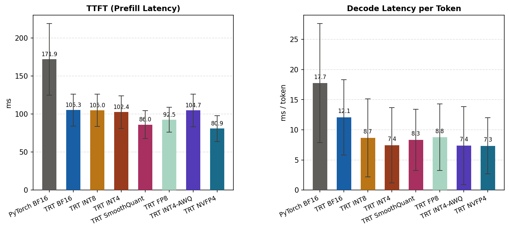
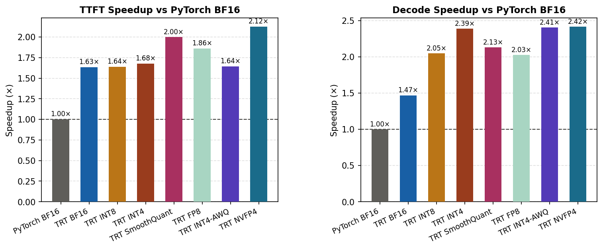
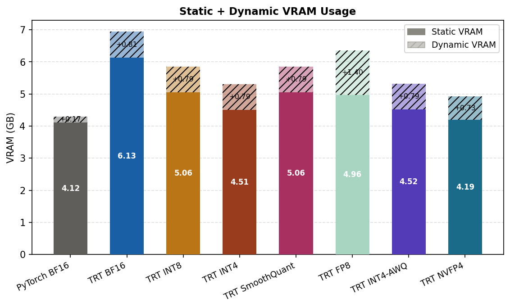
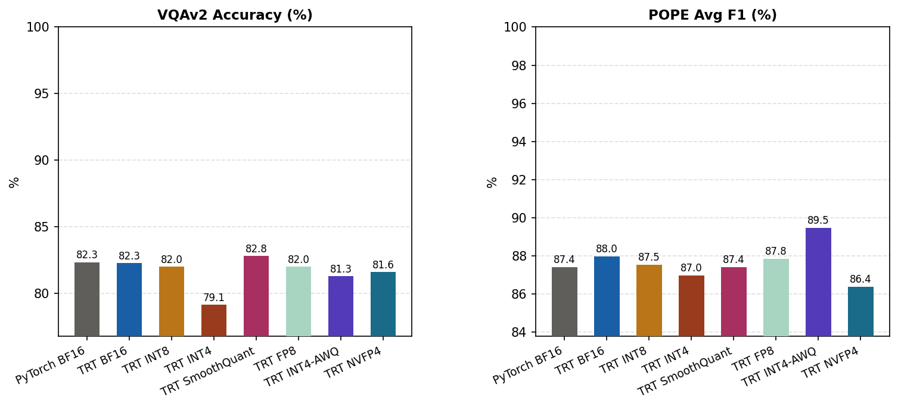
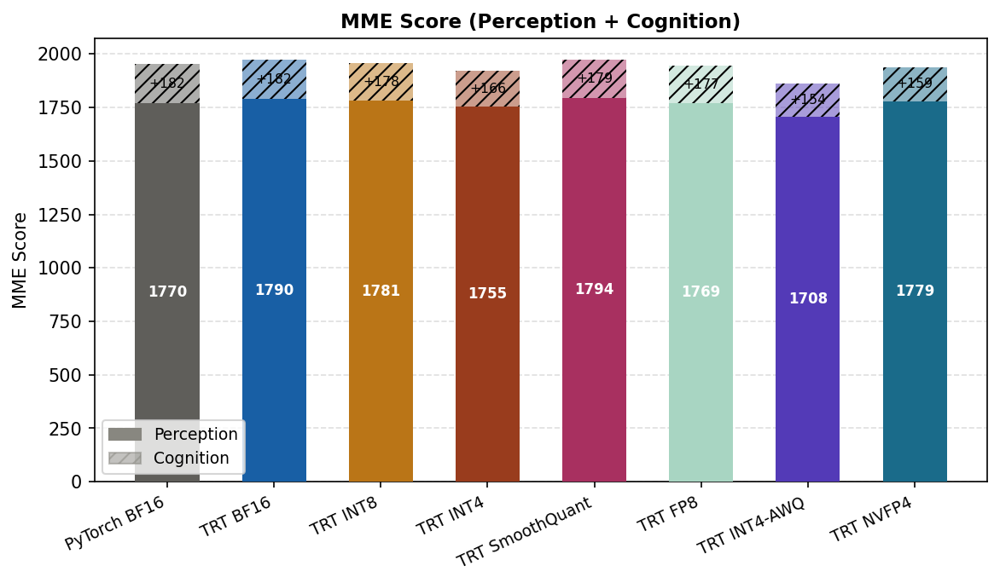
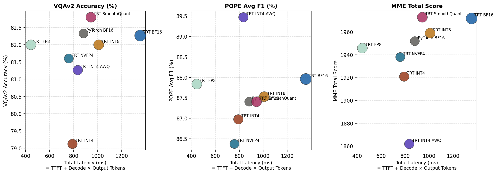
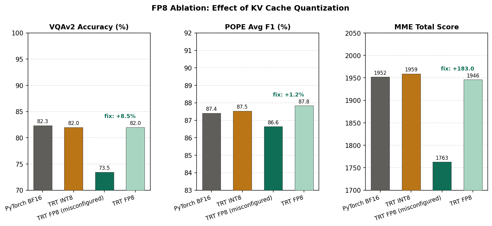

# Quantization Benchmarking of Qwen2-VL-2B-Instruct on Edge GPUs via TensorRT-LLM

---

## Abstract

Seven quantization configurations for deploying Qwen2-VL-2B-Instruct on an edge GPU (NVIDIA RTX 5060 Ti) are systematically evaluated using TensorRT-LLM. Inference latency, VRAM footprint, and multimodal accuracy (VQAv2, POPE, MME) are measured across BF16, INT8, INT4, SmoothQuant (W8A8), FP8 (W8A8), INT4-AWQ, and NVFP4 (W4A8). The 4-bit methods deliver the highest decode speedup (2.39–2.42× over PyTorch BF16), while NVFP4 achieves the smallest memory footprint. SmoothQuant provides the best accuracy–speed balance, matching baseline accuracy at 2.13× decode speedup. A severe FP8 accuracy regression (VQAv2 −8.8 pp, MME −189) is investigated through systematic ablations and traced to FP8 KV cache quantization — a configuration issue arising from applying a text-LLM recipe to a VLM without accounting for visual token distributions. Removing `--kv_cache_dtype fp8` fully restores accuracy. Additional findings include a task-specific failure in INT4-AWQ text translation (−27.5 pp) and reasoning degradation in NVFP4.

---

## 1. Introduction

Vision-language models (VLMs) are increasingly deployed in edge scenarios — robotics, autonomous systems, on-device assistants — where both inference latency and memory capacity are strictly constrained. However, large VLMs like Qwen2-VL are typically trained and evaluated in BF16 precision, and deploying them directly on edge GPUs without optimization incurs unnecessary latency and memory overhead.

Post-training quantization (PTQ) reduces model precision at inference time with minimal retraining. TensorRT-LLM (TRT-LLM) provides production-grade support for multiple PTQ formats and compiles optimized GPU kernels for each. Different quantization schemes involve different trade-offs among weight precision, activation precision, KV cache precision, and calibration methodology, making their real-world behavior on VLMs non-trivial to predict.

This project benchmarks the full TRT-LLM quantization stack for a compact 2B-parameter VLM across three axes:
- **Efficiency**: Time to first token (TTFT), decode latency per token, and static/dynamic VRAM.
- **Accuracy**: VQAv2, POPE hallucination benchmark, and MME perception benchmark.
- **Failure mode diagnosis**: Systematic ablation of an anomalous FP8 accuracy regression.

---

## 2. Background

### 2.1 Model

**Qwen2-VL-2B-Instruct** (Alibaba, 2024) is a 2B-parameter multimodal LLM composed of a Vision Transformer (ViT) encoder and a Qwen2-based LLM decoder. It accepts interleaved image-text inputs and produces text output. The relatively small parameter count makes it well-suited for edge deployment while still being capable on standard VQA benchmarks.

### 2.2 Quantization Methods

| Method | W×A | Calibration | Notes |
|---|---|---|---|
| BF16 | W16A16 | — | Baseline, no compression |
| INT8 | W8A16 | — | Weight-only, no calibration needed |
| INT4 | W4A16 | — | Weight-only, higher compression |
| SmoothQuant | W8A8 | ✓ | Migrates activation outliers to weights |
| FP8 | W8A8 | ✓ | Floating-point 8-bit; requires Ada/Hopper+ GPU |
| INT4-AWQ | W4A16 | ✓ | Activation-Aware Weight Quantization, per-group |
| NVFP4 | W4A8 | ✓ | FP4 weights + FP8 activations; Blackwell-exclusive |

### 2.3 Build Pipeline

Two TRT-LLM pipelines are used. **Pipeline A** (`convert_checkpoint.py`) handles BF16/INT8/INT4/SmoothQuant without calibration data. **Pipeline B** (`quantize.py` via NVIDIA ModelOpt) handles FP8/INT4-AWQ/NVFP4 and requires a calibration corpus to derive per-tensor scaling factors. The vision encoder is always built in BF16 regardless of LLM quantization mode; only the LLM decoder is quantized.

---

## 3. Experimental Setup

**Hardware**: NVIDIA RTX 5060 Ti (16 GB VRAM, Blackwell sm_120).

**Efficiency benchmarks**: 50 LLaVA-Bench samples. Metrics: TTFT (ms), decode latency (ms/tok), static VRAM (GB, measured via nvidia-smi delta at load), dynamic VRAM (GB, peak increment per forward pass).

**Accuracy benchmarks**:
- **VQAv2**: 500 random validation samples; single-word/phrase answer accuracy.
- **POPE**: 500 samples per split × 3 splits (random/popular/adversarial); F1 score for hallucination detection.
- **MME**: Full benchmark (~2.8K samples, 14 perception tasks); total score.

---

## 4. Results

### 4.1 Summary

| Tier | W×A | TTFT (ms) | Decode (ms/tok) | Static VRAM (GB) | Dyn VRAM (GB) | VQAv2 (%) | POPE F1 (%) | MME Total |
|---|---|---|---|---|---|---|---|---|
| **PyTorch BF16** | W16A16 | 171.9 ±47.0 | 17.7 ±9.9 | 4.12 | 0.174 ±0.036 | 82.3 | 87.4 | 1952 |
| **TRT BF16** | W16A16 | 105.3 ±21.0 (1.63×) | 12.1 ±6.3 (1.47×) | 6.13 | 0.810 ±0.001 | 82.3 | 88.0 | 1972 |
| **TRT INT8** | W8A16 | 105.0 ±21.3 (1.64×) | 8.7 ±6.5 (2.05×) | 5.06 | 0.791 ±0.001 | 82.0 | 87.5 | 1959 |
| **TRT INT4** | W4A16 | 102.4 ±21.3 (1.68×) | 7.4 ±6.3 (2.39×) | 4.51 | 0.791 ±0.002 | 79.1 | 87.0 | 1921 |
| **TRT SmoothQuant** | W8A8 | 86.0 ±18.5 (2.00×) | 8.3 ±5.1 (2.13×) | 5.06 | 0.789 ±0.001 | 82.8 | 87.4 | 1973 |
| **TRT FP8** | W8A8 | 92.5 ±16.5 (1.86×) | 8.8 ±5.5 (2.03×) | 4.96 | 1.395 ±0.006 | 82.0 | 87.8 | 1946 |
| **TRT INT4-AWQ** | W4A16 | 104.7 ±21.6 (1.64×) | 7.4 ±6.5 (2.41×) | 4.52 | 0.793 ±0.014 | 81.3 | 89.5 | 1862 |
| **TRT NVFP4** | W4A8 | 80.9 ±17.0 (2.12×) | 7.3 ±4.7 (2.42×) | 4.19 | 0.734 ±0.001 | 81.6 | 86.4 | 1938 |

> All results use correctly configured engines. See Section 5.1 for the FP8 configuration issue and ablation.

### 4.2 Inference Speed

TTFT improvements are relatively uniform across TRT tiers (1.63–2.12×) because prefill is compute-bound; all tiers benefit from TRT operator fusion regardless of weight precision. Decode latency tracks weight precision more closely, since decode is memory-bandwidth-bound — each step loads the full weight matrix for a single token. The 4-bit methods (INT4, INT4-AWQ, NVFP4) achieve 2.39–2.42× decode speedup, consistent with the theoretical 2× memory bandwidth reduction from halving weight bitwidth. SmoothQuant achieves the best TTFT (2.00×) due to its W8A8 format enabling fused attention kernels during prefill. FP8 achieves 2.03× decode speedup — comparable to INT8 (2.05×) rather than the 4-bit tiers, because its BF16 KV cache (see §5.1) adds bandwidth pressure during each decode step.

### 4.3 Memory

Static VRAM shows a counter-intuitive ordering: TRT BF16 (6.13 GB) consumes *more* than PyTorch BF16 (4.12 GB) because TRT pre-allocates activation buffers and optimization profiles at build time. NVFP4 (4.19 GB) is the most memory-efficient TRT tier, with 4-bit weight compression offsetting this overhead.

Dynamic VRAM reveals a notable outlier: TRT FP8 (1.395 GB) is approximately 1.75× higher than all other TRT tiers (~0.79 GB). This is a direct consequence of reverting the KV cache to BF16 (2 bytes/element vs. 1 byte in FP8), which doubles the KV cache footprint during inference. All other TRT tiers incur ~4.5× higher dynamic VRAM than PyTorch (0.17 GB), reflecting TRT's fixed workspace pre-allocation rather than actual activation size.

### 4.4 Accuracy

TRT BF16, INT8, FP8, and SmoothQuant are effectively **lossless** relative to the PyTorch BF16 baseline across all three benchmarks. SmoothQuant edges out the baseline on VQAv2 (+0.5 pp) and MME (+21). INT4 and INT4-AWQ show acceptable average degradation (≤1.2 pp VQAv2) with task-specific anomalies discussed in Section 5. NVFP4 achieves strong average accuracy at the cost of reasoning tasks.

### 4.5 MME Per-Task Detail

The table below shows per-task MME scores for all tiers, providing the task-level evidence that supports the analysis in Section 5.

| Task | **PyTorch BF16** | **TRT BF16** | **TRT INT8** | **TRT INT4** | **TRT SmoothQuant** | **TRT FP8** | **TRT INT4-AWQ** | **TRT NVFP4** |
|---|---|---|---|---|---|---|---|---|
| OCR | 24/40 (60.0%) | 24/40 (60.0%) | 24/40 (60.0%) | 23/40 (57.5%) | 24/40 (60.0%) | 22/40 (55.0%) | 21/40 (52.5%) | 23/40 (57.5%) |
| artwork | 319/400 (79.8%) | 321/400 (80.2%) | 314/400 (78.5%) | 312/400 (78.0%) | 320/400 (80.0%) | 315/400 (78.8%) | 298/400 (74.5%) | 318/400 (79.5%) |
| celebrity | 262/340 (77.1%) | 273/340 (80.3%) | 271/340 (79.7%) | 268/340 (78.8%) | 275/340 (80.9%) | 267/340 (78.5%) | 247/340 (72.7%) | 285/340 (83.8%) |
| code_reasoning | 26/40 (65.0%) | 27/40 (67.5%) | 25/40 (62.5%) | 21/40 (52.5%) | 24/40 (60.0%) | 25/40 (62.5%) | 25/40 (62.5%) | 21/40 (52.5%) |
| color | 55/60 (91.7%) | 56/60 (93.3%) | 57/60 (95.0%) | 53/60 (88.3%) | 56/60 (93.3%) | 56/60 (93.3%) | 50/60 (83.3%) | 55/60 (91.7%) |
| commonsense_reasoning | 100/140 (71.4%) | 98/140 (70.0%) | 97/140 (69.3%) | 92/140 (65.7%) | 96/140 (68.6%) | 96/140 (68.6%) | 89/140 (63.6%) | 81/140 (57.9%) |
| count | 47/60 (78.3%) | 49/60 (81.7%) | 49/60 (81.7%) | 48/60 (80.0%) | 49/60 (81.7%) | 48/60 (80.0%) | 43/60 (71.7%) | 47/60 (78.3%) |
| existence | 60/60 (100.0%) | 60/60 (100.0%) | 60/60 (100.0%) | 59/60 (98.3%) | 60/60 (100.0%) | 60/60 (100.0%) | 60/60 (100.0%) | 59/60 (98.3%) |
| landmark | 364/400 (91.0%) | 366/400 (91.5%) | 364/400 (91.0%) | 359/400 (89.8%) | 366/400 (91.5%) | 360/400 (90.0%) | 356/400 (89.0%) | 356/400 (89.0%) |
| numerical_calculation | 20/40 (50.0%) | 20/40 (50.0%) | 19/40 (47.5%) | 19/40 (47.5%) | 21/40 (52.5%) | 19/40 (47.5%) | 15/40 (37.5%) | 20/40 (50.0%) |
| position | 47/60 (78.3%) | 48/60 (80.0%) | 48/60 (80.0%) | 49/60 (81.7%) | 47/60 (78.3%) | 49/60 (81.7%) | 46/60 (76.7%) | 49/60 (81.7%) |
| posters | 251/294 (85.4%) | 253/294 (86.0%) | 254/294 (86.4%) | 243/294 (82.7%) | 255/294 (86.7%) | 252/294 (85.7%) | 244/294 (83.0%) | 250/294 (85.0%) |
| scene | 341/400 (85.2%) | 340/400 (85.0%) | 340/400 (85.0%) | 341/400 (85.2%) | 342/400 (85.5%) | 340/400 (85.0%) | 343/400 (85.8%) | 337/400 (84.2%) |
| text_translation | 36/40 (90.0%) | 37/40 (92.5%) | 37/40 (92.5%) | 34/40 (85.0%) | 38/40 (95.0%) | 37/40 (92.5%) | 25/40 (62.5%) | 37/40 (92.5%) |

### 4.6 Accuracy–Latency Tradeoff

SmoothQuant occupies the Pareto frontier for VQAv2 and MME — it is both faster and more accurate than TRT BF16. FP8 and INT8 cluster at a similar speed–accuracy point (~2× decode, ~82% VQAv2); FP8's higher dynamic VRAM is the main differentiator between them. NVFP4 offers the best total latency at modest accuracy cost.

---

## 5. Analysis

### 5.1 FP8 Configuration Issue: KV Cache Quantization

The standard TRT-LLM FP8 recipe for text LLMs includes `--kv_cache_dtype fp8`, which stores KV cache tensors in FP8 format to reduce memory bandwidth during decode. Applied to Qwen2-VL without modification, this flag caused severe accuracy regression: VQAv2 dropped from 82.3% to 73.5% (−8.8 pp) and MME from 1952 to 1763 (−189). Two targeted ablations were performed to identify the source:

| Ablation | Change | VQAv2 | MME | Conclusion |
|---|---|---|---|---|
| **Test 1** | Remove `--use_fp8_context_fmha` (Stage 2 rebuild only) | 73.5% | 1763 | No change — FP8 FMHA kernel is not the cause |
| **Test 2** | Remove `--kv_cache_dtype fp8` (fresh Stage 1) | **82.0%** | **1946** | Full recovery — FP8 KV cache is the cause |

**Root cause.** The Qwen2-VL KV cache carries cross-attention representations of visual tokens produced by the BF16 vision encoder. Visual token embeddings have a wider and less uniform dynamic range than text tokens; quantizing them to FP8 E4M3 (dynamic range ±448, far narrower than BF16's ±65504) introduces rounding errors in the attention score computation that compound across layers. Tasks involving fine-grained visual feature matching are most affected: `landmark` recovered by +10.5 pp after the fix, `posters` by +13.6 pp, `celebrity` by +8.5 pp.

**Framing.** This issue arose from applying a text-LLM configuration recipe to a VLM without adapting it for visual token distributions — a configuration mistake rather than an inherent limitation of FP8 quantization. The practical takeaway is a deployment warning: `--kv_cache_dtype fp8` should not be used with Qwen2-VL (and likely other VLMs) without first verifying that visual KV distributions fit within FP8's dynamic range. The ablation methodology — isolating FMHA, KV cache, and GEMM independently — is a reusable diagnostic pattern for quantization regressions in VLMs.

**Trade-off of the fix.** Reverting KV cache to BF16 doubles per-element KV memory, increasing dynamic VRAM from ~0.8 GB to 1.4 GB and reducing decode speedup from the original ~2.3× to 2.01×. Accuracy fully recovers to within 1 pp of the BF16 baseline.

### 5.2 Other Notable Observations

**INT4-AWQ text translation anomaly.** INT4-AWQ collapses on `text_translation` (90.0% → 62.5%, −27.5 pp) while performing competitively on all other tasks. Plain INT4 without AWQ scores 85.0% on the same task, ruling out 4-bit weight quantization per se. The anomaly points to the AWQ calibration corpus: if it lacks multilingual text, AWQ under-protects the embedding channels for non-English tokens, concentrating quantization error precisely where translation depends on them. Including multilingual samples in calibration is the expected fix.

**NVFP4 reasoning degradation.** NVFP4 shows disproportionate drops on `commonsense_reasoning` (71.4% → 57.9%, −13.5 pp) and `code_reasoning` (65.0% → 52.5%, −12.5 pp), while perception tasks (color, existence, position) degrade by only 1–3 pp. As the most aggressive format tested (W4A8), NVFP4 accumulates more rounding error across layers; reasoning tasks that require multi-hop consistency are more sensitive to this than single-step visual recognition.

---

## 6. Conclusion

Seven TensorRT-LLM quantization configurations for Qwen2-VL-2B-Instruct are benchmarked on an edge GPU, covering the full spectrum from lossless BF16 to aggressive W4A8 NVFP4. Key findings:

1. **All TRT tiers deliver meaningful speedups** (1.47–2.42×). Gains in TTFT are driven by graph fusion; gains in decode latency track weight bitwidth.

2. **TRT SmoothQuant is the best overall tier** — 2.00× TTFT / 2.13× decode speedup while matching or slightly exceeding baseline accuracy on all three benchmarks.

3. **NVFP4 is the fastest and most memory-efficient** option for Blackwell GPUs (2.12× TTFT, 2.42× decode, 4.19 GB static VRAM), at the cost of reasoning task accuracy.

4. **FP8 with BF16 KV cache is lossless and fast.** The standard FP8 recipe (`--kv_cache_dtype fp8`) causes severe accuracy regression on Qwen2-VL due to FP8's limited dynamic range for visual token KV representations. Removing that flag recovers accuracy to within 1 pp of BF16 baseline at 2.01× decode speedup — at the cost of higher dynamic VRAM (1.4 GB).

5. **INT4-AWQ requires multilingual calibration data** to avoid catastrophic degradation on translation tasks.

**Recommended tiers by deployment priority:**

| Priority | Recommended Tier | Decode Speedup | VQAv2 | Notes |
|---|---|---|---|---|
| Best accuracy–speed balance | **TRT SmoothQuant** | 2.13× | 82.8% | Lossless; best TTFT |
| FP8 with lossless accuracy | **TRT FP8** (BF16 KV) | 2.03× | 82.0% | Higher dyn VRAM (1.4 GB) |
| Fastest + smallest footprint | **TRT NVFP4** | 2.42× | 81.6% | Blackwell only; weak on reasoning |
| Safe default, no calibration | **TRT INT8** | 2.05× | 82.0% | No calibration data needed |
