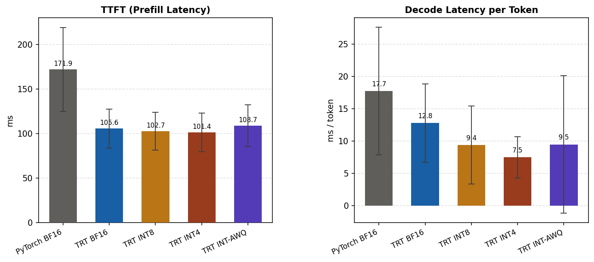
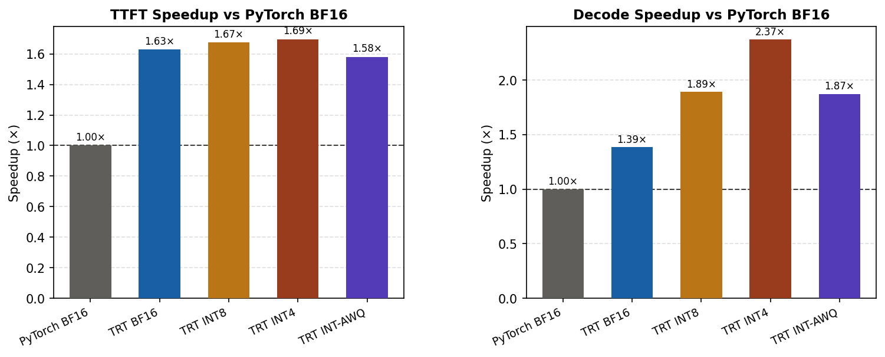
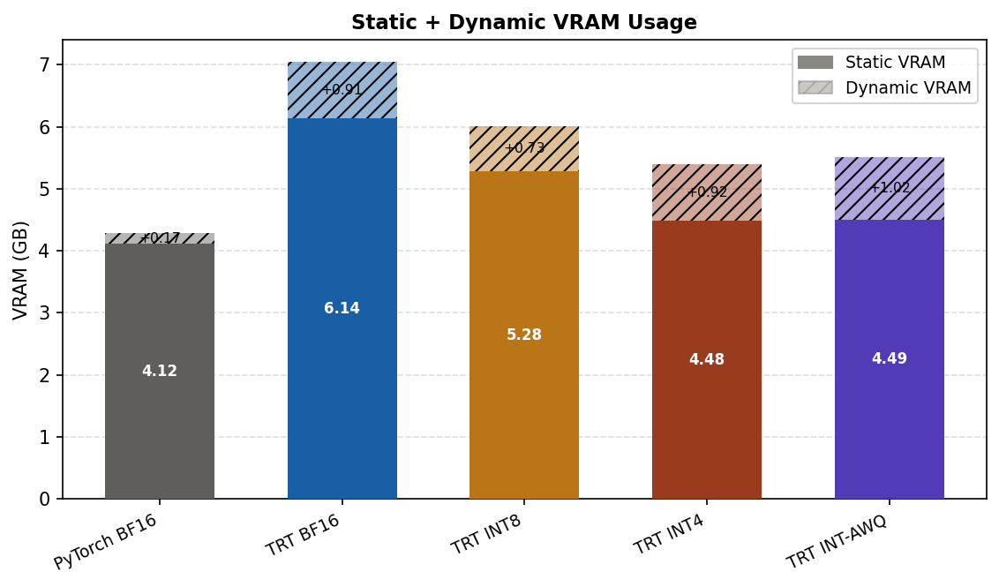
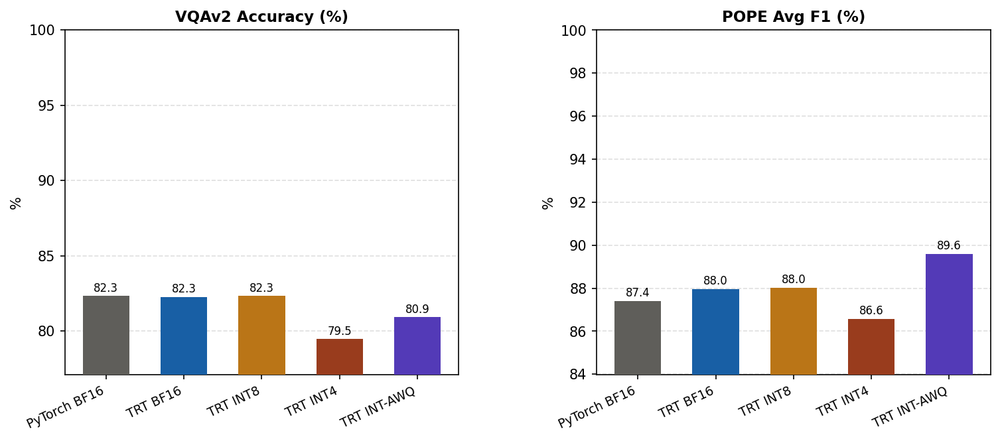
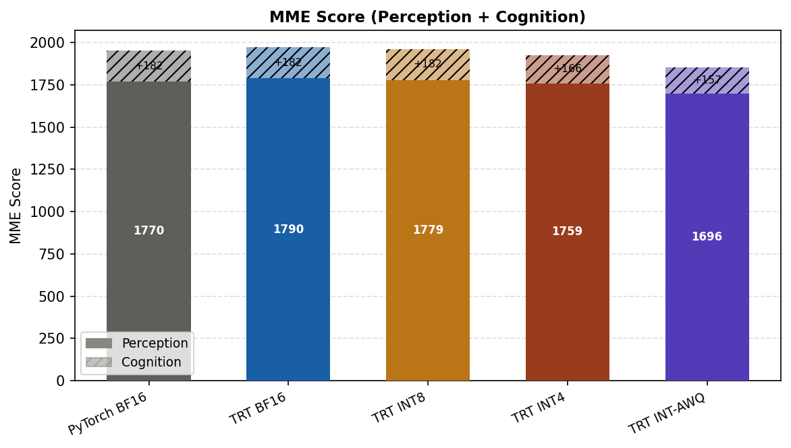
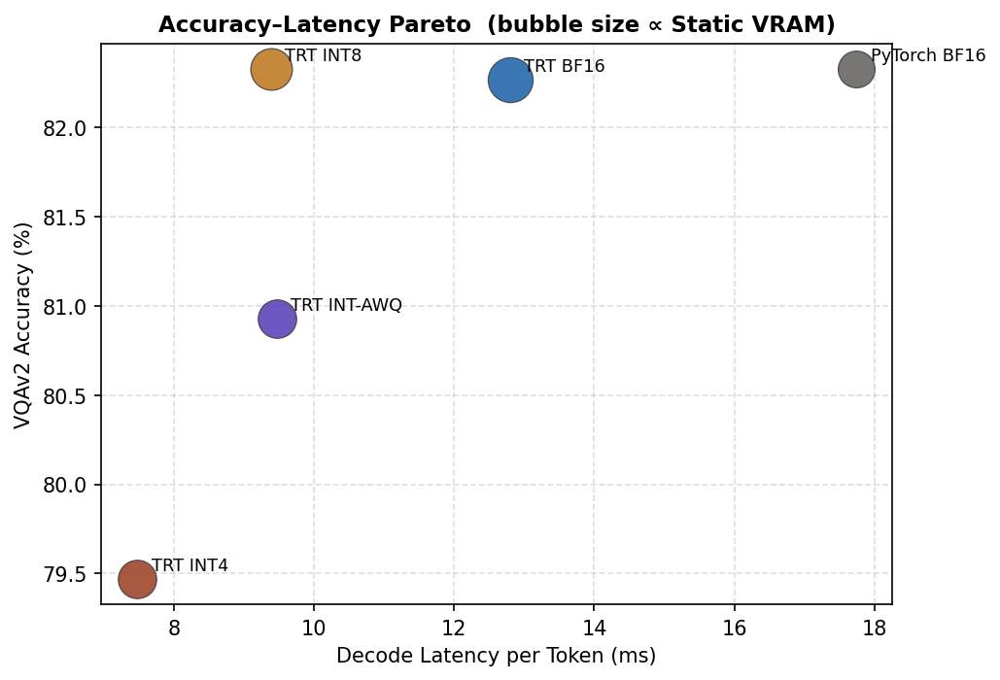

# Qwen2-VL-2B-Instruct — Quantization Benchmark Results

> Auto-generated by `report.py`. Efficiency: mean ± std over benchmark samples. Speedup ratio in parentheses = PyTorch BF16 latency ÷ current latency.

## Results Summary

| Tier | TTFT (ms) | Decode (ms/tok) | Static VRAM (GB) | Dyn VRAM (GB) | VQAv2 (%) | POPE F1 (%) | MME Total |
|---|---|---|---|---|---|---|---|
| **PyTorch BF16** | 171.9 ±47.0 | 17.7 ±9.9 | 4.12 | 0.174 ±0.036 | 82.3 | 87.4 | 1952 |
| **TRT BF16** | 105.6 ±21.8 (1.63×) | 12.8 ±6.1 (1.39×) | 6.14 | 0.907 ±0.001 | 82.3 | 88.0 | 1972 |
| **TRT INT8** | 102.7 ±21.2 (1.67×) | 9.4 ±6.0 (1.89×) | 5.28 | 0.729 ±0.056 | 82.3 | 88.0 | 1961 |
| **TRT INT4** | 101.4 ±21.8 (1.69×) | 7.5 ±3.2 (2.37×) | 4.48 | 0.915 ±0.001 | 79.5 | 86.6 | 1925 |
| **TRT INT-AWQ** | 108.7 ±23.4 (1.58×) | 9.5 ±10.7 (1.87×) | 4.49 | 1.016 ±0.002 | 80.9 | 89.6 | 1853 |

## Speed

Prefill (TTFT) and decode latency measured separately. Error bars = ±1 std across samples.

### Speedup vs PyTorch BF16

## Memory

Static VRAM = model loaded, before inference. Dynamic VRAM = additional peak during one forward pass.
TRT static VRAM include pre-allocated buffer for activation and profile. Therefore, the TRT static VRAM bigger than pytorch baseline.

## Accuracy

VQAv2 (500 samples), POPE (adversarial/popular/random subsets), MME (full benchmark).

### MME Score

## Accuracy–Latency Tradeoff

Each point is one quantization tier. Bubble size scales with static VRAM.

## POPE Detail

- **PyTorch BF16**: avg F1 = 87.4%, avg acc = 88.47
- **TRT BF16**: avg F1 = 88.0%, avg acc = 88.87
- **TRT INT8**: avg F1 = 88.0%, avg acc = 88.93
- **TRT INT4**: avg F1 = 86.6%, avg acc = 87.8
- **TRT INT-AWQ**: avg F1 = 89.6%, avg acc = 89.87
