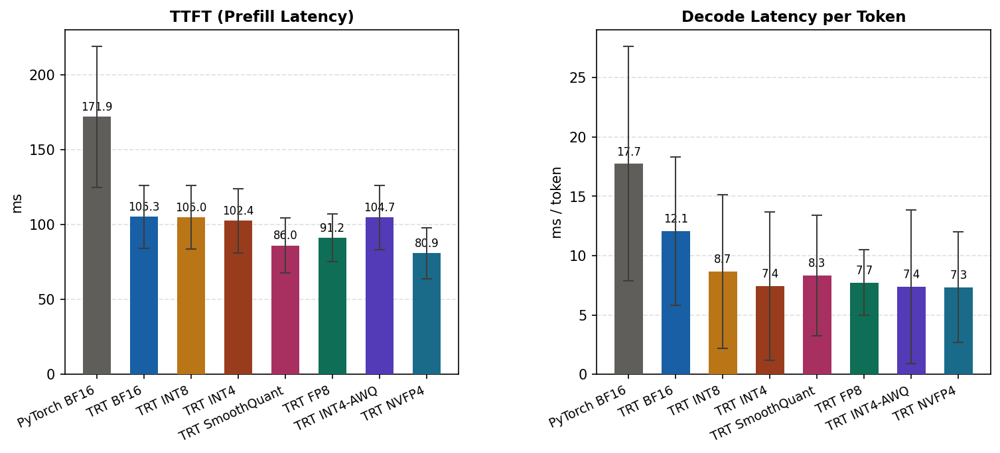
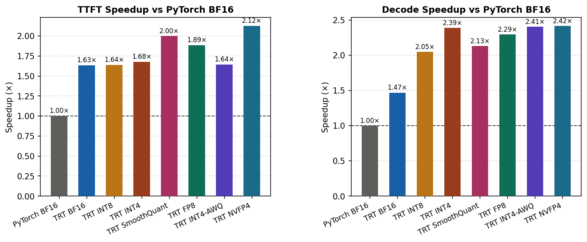
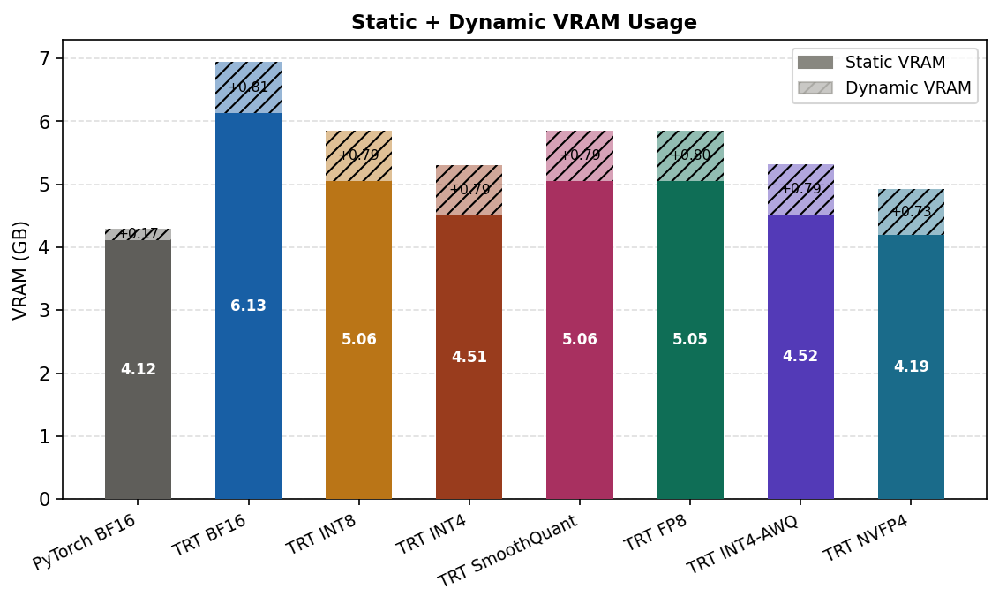
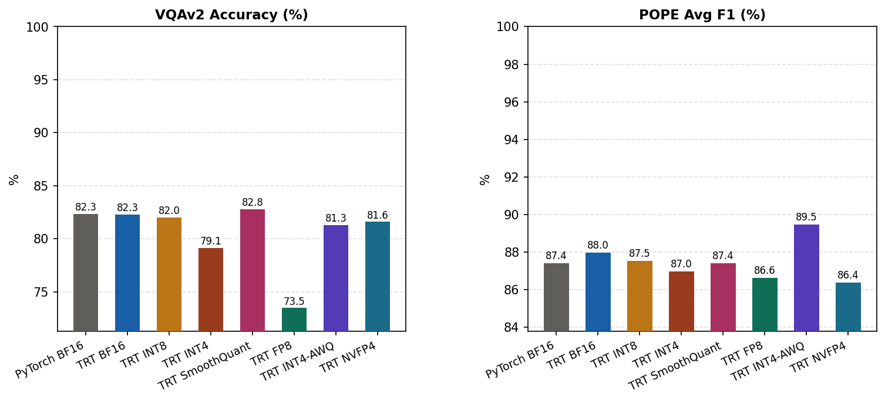
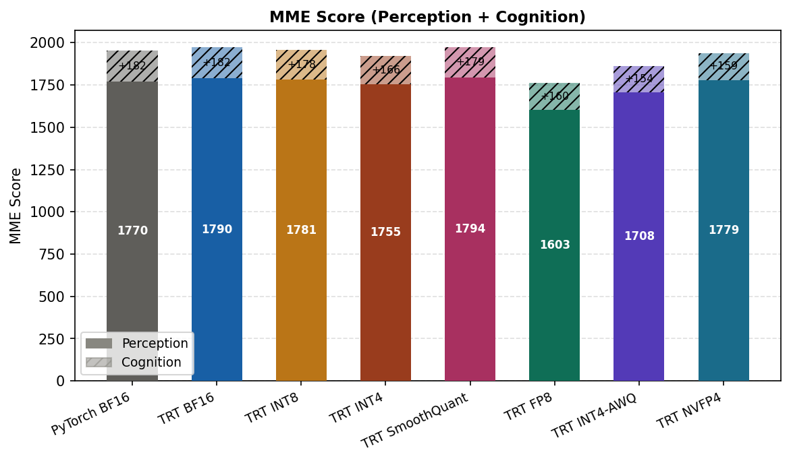
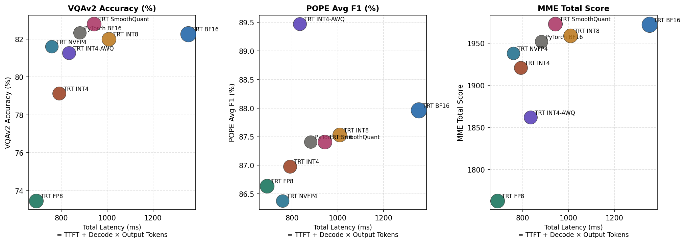

# Qwen2-VL-2B-Instruct — Quantization Benchmark Results

> Auto-generated by `report.py`. Efficiency: mean ± std over benchmark samples. Speedup ratio in parentheses = PyTorch BF16 latency ÷ current latency.

## Results Summary

| Tier | TTFT (ms) | Decode (ms/tok) | Static VRAM (GB) | Dyn VRAM (GB) | VQAv2 (%) | POPE F1 (%) | MME Total |
|---|---|---|---|---|---|---|---|
| **PyTorch BF16** | 171.9 ±47.0 | 17.7 ±9.9 | 4.12 | 0.174 ±0.036 | 82.3 | 87.4 | 1952 |
| **TRT BF16** | 105.3 ±21.0 (1.63×) | 12.1 ±6.3 (1.47×) | 6.13 | 0.810 ±0.001 | 82.3 | 88.0 | 1972 |
| **TRT INT8** | 105.0 ±21.3 (1.64×) | 8.7 ±6.5 (2.05×) | 5.06 | 0.791 ±0.001 | 82.0 | 87.5 | 1959 |
| **TRT INT4** | 102.4 ±21.3 (1.68×) | 7.4 ±6.3 (2.39×) | 4.51 | 0.791 ±0.002 | 79.1 | 87.0 | 1921 |
| **TRT SmoothQuant** | 86.0 ±18.5 (2.00×) | 8.3 ±5.1 (2.13×) | 5.06 | 0.789 ±0.001 | 82.8 | 87.4 | 1973 |
| **TRT FP8** | 91.2 ±15.9 (1.89×) | 7.7 ±2.8 (2.29×) | 5.05 | 0.799 ±0.001 | 73.5 | 86.6 | 1763 |
| **TRT INT4-AWQ** | 104.7 ±21.6 (1.64×) | 7.4 ±6.5 (2.41×) | 4.52 | 0.793 ±0.014 | 81.3 | 89.5 | 1862 |
| **TRT NVFP4** | 80.9 ±17.0 (2.12×) | 7.3 ±4.7 (2.42×) | 4.19 | 0.734 ±0.001 | 81.6 | 86.4 | 1938 |

## Speed

Prefill (TTFT) and decode latency measured separately. Error bars = ±1 std across samples.

### Speedup vs PyTorch BF16

## Memory

Static VRAM = model loaded, before inference. Dynamic VRAM = additional peak during one forward pass.
TRT static VRAM include pre-allocated buffer for activation and profile. Therefore, the TRT static VRAM bigger than pytorch baseline.

## Accuracy

VQAv2 (500 samples), POPE (adversarial/popular/random subsets), MME (full benchmark).

### MME Score

## Accuracy–Latency Tradeoff

X-axis: total end-to-end latency (TTFT + decode latency × mean output tokens). Each point is one quantization tier. Bubble size scales with static VRAM.

## MME Per-Task Detail

| Task | **PyTorch BF16** | **TRT BF16** | **TRT INT8** | **TRT INT4** | **TRT SmoothQuant** | **TRT FP8** | **TRT INT4-AWQ** | **TRT NVFP4** |
|---|---|---|---|---|---|---|---|---|
| OCR | 24/40 (60.0%) | 24/40 (60.0%) | 24/40 (60.0%) | 23/40 (57.5%) | 24/40 (60.0%) | 20/40 (50.0%) | 21/40 (52.5%) | 23/40 (57.5%) |
| artwork | 319/400 (79.8%) | 321/400 (80.2%) | 314/400 (78.5%) | 312/400 (78.0%) | 320/400 (80.0%) | 298/400 (74.5%) | 298/400 (74.5%) | 318/400 (79.5%) |
| celebrity | 262/340 (77.1%) | 273/340 (80.3%) | 271/340 (79.7%) | 268/340 (78.8%) | 275/340 (80.9%) | 238/340 (70.0%) | 247/340 (72.7%) | 285/340 (83.8%) |
| code_reasoning | 26/40 (65.0%) | 27/40 (67.5%) | 25/40 (62.5%) | 21/40 (52.5%) | 24/40 (60.0%) | 19/40 (47.5%) | 25/40 (62.5%) | 21/40 (52.5%) |
| color | 55/60 (91.7%) | 56/60 (93.3%) | 57/60 (95.0%) | 53/60 (88.3%) | 56/60 (93.3%) | 50/60 (83.3%) | 50/60 (83.3%) | 55/60 (91.7%) |
| commonsense_reasoning | 100/140 (71.4%) | 98/140 (70.0%) | 97/140 (69.3%) | 92/140 (65.7%) | 96/140 (68.6%) | 86/140 (61.4%) | 89/140 (63.6%) | 81/140 (57.9%) |
| count | 47/60 (78.3%) | 49/60 (81.7%) | 49/60 (81.7%) | 48/60 (80.0%) | 49/60 (81.7%) | 44/60 (73.3%) | 43/60 (71.7%) | 47/60 (78.3%) |
| existence | 60/60 (100.0%) | 60/60 (100.0%) | 60/60 (100.0%) | 59/60 (98.3%) | 60/60 (100.0%) | 58/60 (96.7%) | 60/60 (100.0%) | 59/60 (98.3%) |
| landmark | 364/400 (91.0%) | 366/400 (91.5%) | 364/400 (91.0%) | 359/400 (89.8%) | 366/400 (91.5%) | 318/400 (79.5%) | 356/400 (89.0%) | 356/400 (89.0%) |
| numerical_calculation | 20/40 (50.0%) | 20/40 (50.0%) | 19/40 (47.5%) | 19/40 (47.5%) | 21/40 (52.5%) | 21/40 (52.5%) | 15/40 (37.5%) | 20/40 (50.0%) |
| position | 47/60 (78.3%) | 48/60 (80.0%) | 48/60 (80.0%) | 49/60 (81.7%) | 47/60 (78.3%) | 43/60 (71.7%) | 46/60 (76.7%) | 49/60 (81.7%) |
| posters | 251/294 (85.4%) | 253/294 (86.0%) | 254/294 (86.4%) | 243/294 (82.7%) | 255/294 (86.7%) | 212/294 (72.1%) | 244/294 (83.0%) | 250/294 (85.0%) |
| scene | 341/400 (85.2%) | 340/400 (85.0%) | 340/400 (85.0%) | 341/400 (85.2%) | 342/400 (85.5%) | 322/400 (80.5%) | 343/400 (85.8%) | 337/400 (84.2%) |
| text_translation | 36/40 (90.0%) | 37/40 (92.5%) | 37/40 (92.5%) | 34/40 (85.0%) | 38/40 (95.0%) | 34/40 (85.0%) | 25/40 (62.5%) | 37/40 (92.5%) |

## POPE Detail

- **PyTorch BF16**: avg F1 = 87.4%, avg acc = 88.47
- **TRT BF16**: avg F1 = 88.0%, avg acc = 88.87
- **TRT INT8**: avg F1 = 87.5%, avg acc = 88.53
- **TRT INT4**: avg F1 = 87.0%, avg acc = 88.13
- **TRT SmoothQuant**: avg F1 = 87.4%, avg acc = 88.47
- **TRT FP8**: avg F1 = 86.6%, avg acc = 87.73
- **TRT INT4-AWQ**: avg F1 = 89.5%, avg acc = 89.8
- **TRT NVFP4**: avg F1 = 86.4%, avg acc = 87.67
